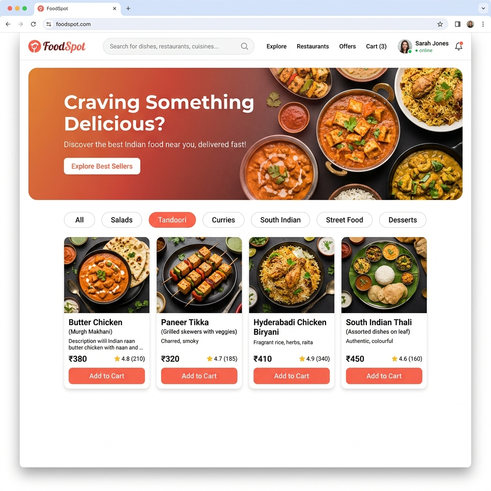
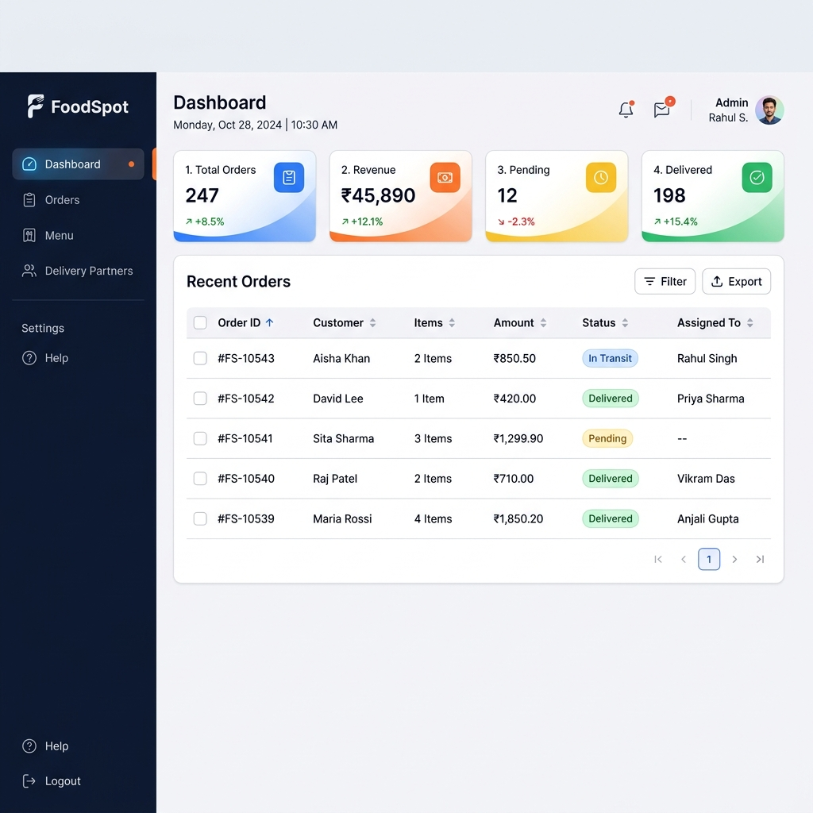
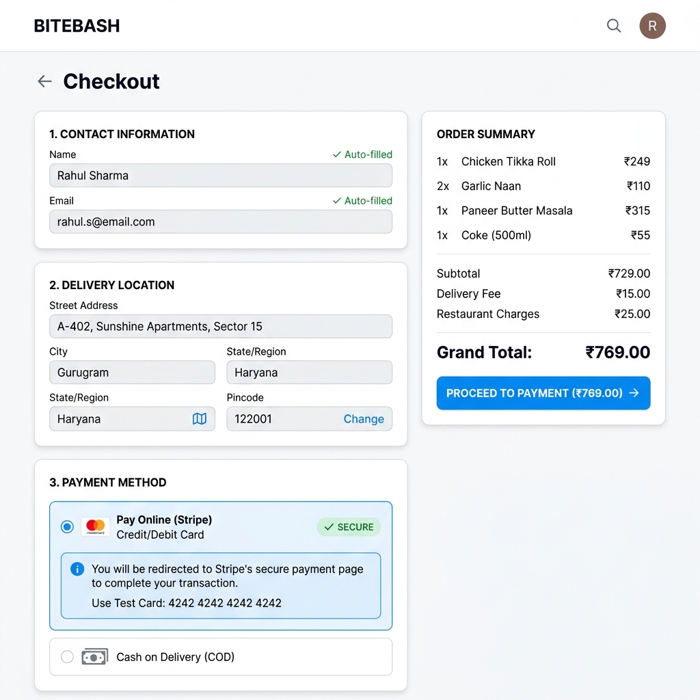
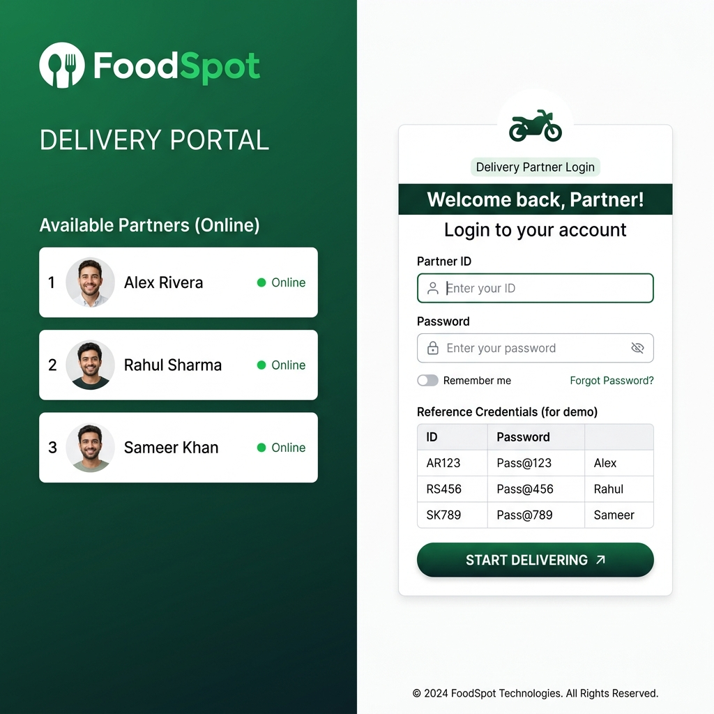
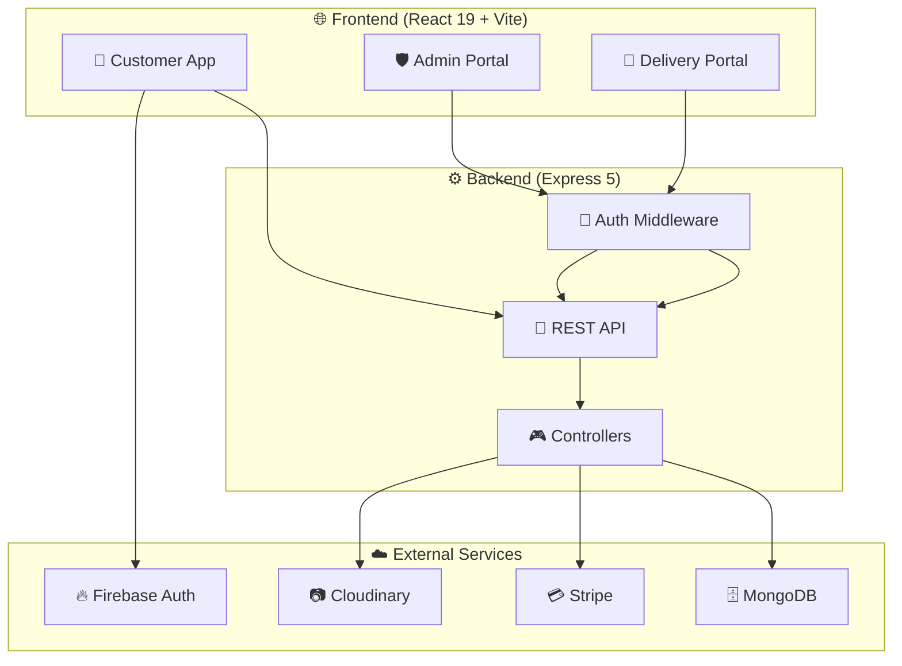

<div align="center">
  
  

  <br />
  <br />

  <h1>🍽️ FoodSpot</h1>
  <h3>Enterprise-Grade Food Delivery Platform</h3>

  <p>
    A complete <strong>MERN stack</strong> food delivery system with role-based portals for <strong>Customers</strong>, <strong>Admins</strong>, and <strong>Delivery Partners</strong> — featuring <strong>Stripe payments</strong>, <strong>Google OAuth</strong>, real-time order tracking, and a premium responsive UI.
  </p>

  <br />

  <p>
    
    
    
    
  </p>
  <p>
    
    
    
    
  </p>

  <br />

  <p>
    <a href="#-quick-start"><strong>Quick Start »</strong></a>
    &nbsp;&nbsp;·&nbsp;&nbsp;
    <a href="#-features"><strong>Features »</strong></a>
    &nbsp;&nbsp;·&nbsp;&nbsp;
    <a href="#-api-reference"><strong>API Docs »</strong></a>
    &nbsp;&nbsp;·&nbsp;&nbsp;
    <a href="#-portal-credentials"><strong>Demo Access »</strong></a>
  </p>

</div>

<br />

---

<br />

## 📑 Table of Contents

<details>
<summary>Click to expand</summary>

- [Overview](#-overview)
- [Screenshots](#-screenshots)
- [Features](#-features)
- [Architecture](#-architecture)
- [Tech Stack](#-tech-stack)
- [Quick Start](#-quick-start)
- [Environment Variables](#-environment-variables)
- [Portal Credentials](#-portal-credentials)
- [API Reference](#-api-reference)
- [Payment Integration](#-payment-integration)
- [Authentication](#-authentication)
- [Project Structure](#-project-structure)
- [Roadmap](#-roadmap)
- [Contributing](#-contributing)
- [License](#-license)

</details>

<br />

## 🌟 Overview

**FoodSpot** is not just another food delivery UI — it's a **production-ready, full-stack platform** engineered for real-world deployment. The application implements complete order lifecycle management across three isolated, role-based portals:

| Portal | Purpose | Access |
|:---|:---|:---|
| 🌐 **Customer App** | Browse, order, pay, track | Public — sign up / Google login |
| 🛡️ **Admin Dashboard** | Manage orders, menu, revenue, assign deliveries | `/admin-login` — credentials required |
| 🚴 **Delivery Portal** | View assigned orders, update delivery status | `/delivery-login` — partner ID required |

Each portal has **its own authentication flow**, **JWT-based session management**, and **zero cross-visibility** — customers cannot see or access admin/delivery routes.

<br />

## 📸 Screenshots

<table>
  <tr>
    <td width="50%">
      
      <p align="center"><strong>Customer Homepage</strong><br/><sub>Hero banner, category filters, food card grid</sub></p>
    </td>
    <td width="50%">
      
      <p align="center"><strong>Admin Dashboard</strong><br/><sub>Order management, revenue stats, menu control</sub></p>
    </td>
  </tr>
  <tr>
    <td width="50%">
      
      <p align="center"><strong>Checkout & Payments</strong><br/><sub>Auto-filled form, Stripe / COD payment</sub></p>
    </td>
    <td width="50%">
      
      <p align="center"><strong>Delivery Partner Login</strong><br/><sub>Partner ID auth, assigned order management</sub></p>
    </td>
  </tr>
</table>

<br />

## ✨ Features

### 🛒 Customer Experience

| Feature | Description |
|:---|:---|
| **50+ Indian Dishes** | Curated catalog across 8 categories — Curries, Tandoori, South Indian, Street Food, Desserts, Drinks, Salads, Thali |
| **Smart Search** | Real-time dish search by name, category, or ingredient |
| **Dynamic Cart** | Add/remove items with instant quantity & total updates |
| **Auto-filled Checkout** | Personal details pre-populated for logged-in users |
| **Stripe Payment** | PCI-compliant hosted checkout (cards, UPI, netbanking) |
| **Cash on Delivery** | Alternative payment method with full order flow |
| **Order Tracking** | 4-stage visual timeline: Placed → Verified → In Transit → Delivered |
| **Google OAuth** | One-click sign-in via Firebase Google Authentication |
| **Responsive Design** | Optimized for desktop, tablet, and mobile viewports |

### 🛡️ Admin Capabilities

| Feature | Description |
|:---|:---|
| **Real-time Dashboard** | Live stats — total orders, revenue, pending, delivered |
| **Order Lifecycle** | View all orders, update status, track payment type |
| **Menu CRUD** | Add, edit, delete dishes with category, price, and image control |
| **Delivery Assignment** | Assign any order to registered delivery partners |
| **Revenue Tracking** | Total revenue calculation with payment method breakdown |

### 🚴 Delivery Partner Tools

| Feature | Description |
|:---|:---|
| **Unique ID Login** | Each partner has a unique ID (e.g., `DB-101`) and password |
| **Filtered Orders** | View only orders assigned to the logged-in partner |
| **Status Lifecycle** | One-tap updates: Pick Up → In Transit → Delivered |
| **Quick Actions** | Simulated customer call and map navigation buttons |

<br />

## 🏗️ Architecture



### Request Flow

```
Customer → React App → Axios → Express API → JWT Middleware → Controller → MongoDB
                                    ↕                              ↕
                              Stripe API                    Cloudinary CDN
```

<br />

## 🛠️ Tech Stack

<table>
  <thead>
    <tr>
      <th>Layer</th>
      <th>Technology</th>
      <th>Version</th>
      <th>Purpose</th>
    </tr>
  </thead>
  <tbody>
    <tr><td rowspan="7"><strong>Frontend</strong></td><td>React</td><td>19.2</td><td>Component framework</td></tr>
    <tr><td>Vite</td><td>8.0</td><td>Build tool & dev server</td></tr>
    <tr><td>React Router</td><td>7.13</td><td>Client-side routing</td></tr>
    <tr><td>Axios</td><td>1.19</td><td>HTTP client</td></tr>
    <tr><td>Firebase</td><td>12.16</td><td>Google OAuth</td></tr>
    <tr><td>React Icons</td><td>5.6</td><td>Icon library (Bi, Fa, Md)</td></tr>
    <tr><td>React Toastify</td><td>11.0</td><td>Toast notifications</td></tr>
    <tr><td rowspan="7"><strong>Backend</strong></td><td>Node.js</td><td>18+</td><td>Runtime</td></tr>
    <tr><td>Express</td><td>5.2</td><td>Web framework</td></tr>
    <tr><td>Mongoose</td><td>9.3</td><td>MongoDB ODM</td></tr>
    <tr><td>Stripe SDK</td><td>20.4</td><td>Payment processing</td></tr>
    <tr><td>JWT</td><td>9.0</td><td>Token authentication</td></tr>
    <tr><td>bcrypt</td><td>6.0</td><td>Password hashing</td></tr>
    <tr><td>Multer</td><td>2.1</td><td>File upload handling</td></tr>
    <tr><td><strong>Database</strong></td><td>MongoDB</td><td>Latest</td><td>Document store</td></tr>
    <tr><td><strong>Storage</strong></td><td>Cloudinary</td><td>2.9</td><td>Image CDN</td></tr>
  </tbody>
</table>

<br />

## 🚀 Quick Start

### Prerequisites

| Requirement | Minimum Version |
|:---|:---|
| Node.js | `>= 18.x` |
| npm | `>= 9.x` |
| MongoDB | Running locally or Atlas URI |

### Installation

```bash
# 1. Clone the repository
git clone https://github.com/Manishsah098/FoodSpot.git
cd FoodSpot

# 2. Install backend dependencies
cd backend
npm install

# 3. Configure environment variables
# Create .env file (see Environment Variables section below)

# 4. Install frontend dependencies
cd ../frontend
npm install
```

### Running the Application

```bash
# Terminal 1 — Start backend server
cd backend
npm run server
# → API running at http://localhost:4000

# Terminal 2 — Start frontend dev server
cd frontend
npm run dev
# → App running at http://localhost:5173
```

### Production Build

```bash
cd frontend
npm run build
npm run preview
```

<br />

## 🔧 Environment Variables

### Backend (`backend/.env`)

```env
# ─── Database ───
MONGODB_URI=mongodb://localhost:27017

# ─── Authentication ───
JWT_SECRET=your_super_secret_jwt_key
ADMIN_EMAIL=admin@gmail.com
ADMIN_PASSWORD=admin123

# ─── Cloudinary (Image Uploads) ───
CLOUDINARY_NAME=your_cloud_name
CLOUDINARY_API_KEY=your_api_key
CLOUDINAY_SECRET_KEY=your_api_secret

# ─── Stripe (Payments) ───
STRIPE_SECRET_KEY=sk_test_your_stripe_secret_key
FRONTEND_URL=http://localhost:5173

# ─── Delivery Partners (JSON) ───
DELIVERY_PARTNERS=[{"id":"DB-101","name":"Alex Rivera","phone":"+91 98765 43210","vehicle":"Honda Activa","password":"alex@delivery"},{"id":"DB-102","name":"Rahul Sharma","phone":"+91 98123 45678","vehicle":"TVS NTORQ","password":"rahul@delivery"},{"id":"DB-103","name":"Sameer Khan","phone":"+91 99555 12345","vehicle":"Royal Enfield","password":"sameer@delivery"}]
```

### Frontend (`frontend/src/config/firebase.js`)

```js
const firebaseConfig = {
  apiKey: "your_firebase_api_key",
  authDomain: "your-project.firebaseapp.com",
  projectId: "your-project-id",
  storageBucket: "your-project.appspot.com",
  messagingSenderId: "000000000000",
  appId: "1:000000000000:web:your_app_id"
};
```

<br />

## 🔑 Portal Credentials

<table>
  <thead>
    <tr>
      <th>Portal</th>
      <th>URL</th>
      <th>Login ID</th>
      <th>Password</th>
    </tr>
  </thead>
  <tbody>
    <tr>
      <td>🛡️ <strong>Admin</strong></td>
      <td><code>/admin-login</code></td>
      <td><code>admin@gmail.com</code></td>
      <td><code>admin123</code></td>
    </tr>
    <tr>
      <td>🚴 <strong>Delivery</strong> — Alex</td>
      <td><code>/delivery-login</code></td>
      <td><code>DB-101</code></td>
      <td><code>alex@delivery</code></td>
    </tr>
    <tr>
      <td>🚴 <strong>Delivery</strong> — Rahul</td>
      <td><code>/delivery-login</code></td>
      <td><code>DB-102</code></td>
      <td><code>rahul@delivery</code></td>
    </tr>
    <tr>
      <td>🚴 <strong>Delivery</strong> — Sameer</td>
      <td><code>/delivery-login</code></td>
      <td><code>DB-103</code></td>
      <td><code>sameer@delivery</code></td>
    </tr>
  </tbody>
</table>

> **🔒 Security Note:** The customer navbar has zero links to admin or delivery portals. Navigating directly to `/admin` or `/delivery` without a valid token auto-redirects to the respective login page.

<br />

## 📡 API Reference

### Authentication — `/api/user`

```http
POST /api/user/register        # Create customer account
POST /api/user/login            # Email + password login → JWT
POST /api/user/google-login     # Firebase Google OAuth → JWT
POST /api/user/admin            # Admin login → Admin JWT
```

### Orders — `/api/order`

```http
POST   /api/order/place         # Place COD order             [Customer JWT]
POST   /api/order/stripe        # Create Stripe session       [Customer JWT]
POST   /api/order/verifyStripe  # Verify payment callback     [Public]
POST   /api/order/userorders    # Get logged-in user's orders [Customer JWT]
GET    /api/order/list          # Get all orders              [Admin JWT]
POST   /api/order/status        # Update order status         [Admin JWT]
POST   /api/order/assign        # Assign delivery partner     [Admin JWT]
```

### Delivery — `/api/delivery`

```http
POST   /api/delivery/login         # Partner ID + password auth
GET    /api/delivery/orders        # Get assigned orders      [Delivery JWT]
POST   /api/delivery/updatestatus  # Update delivery status   [Delivery JWT]
```

### Products — `/api/product`

```http
POST   /api/product/add        # Add new dish               [Admin JWT]
GET    /api/product/list       # Get all dishes             [Public]
POST   /api/product/remove     # Delete a dish              [Admin JWT]
```

<br />

## 💳 Payment Integration

FoodSpot uses **Stripe Checkout Sessions** for PCI-compliant, hosted payment processing.

### Payment Flow

```
┌──────────────┐    ┌──────────────┐    ┌──────────────┐    ┌──────────────┐
│   Customer   │───▶│  Backend API │───▶│   Stripe     │───▶│  Customer    │
│ selects      │    │ creates      │    │  hosted      │    │ redirected   │
│ "Pay Online" │    │ checkout     │    │  checkout    │    │ to /orders   │
│              │    │ session      │    │  page        │    │ on success   │
└──────────────┘    └──────────────┘    └──────────────┘    └──────────────┘
```

### Test Cards

| Card Number | Behavior |
|:---|:---|
| `4242 4242 4242 4242` | ✅ Successful payment |
| `4000 0000 0000 9995` | ❌ Card declined |
| `4000 0025 0000 3155` | 🔐 Requires 3D Secure authentication |

> Use any future expiry date and any 3-digit CVV for testing.

<br />

## 🔐 Authentication

### Three-Tier Auth System

| Role | Method | Token Storage | Protected Routes |
|:---|:---|:---|:---|
| **Customer** | Email/Password or Google OAuth | `localStorage.userToken` | `/checkout`, `/orders` |
| **Admin** | Email + Password (env-based) | `localStorage.adminToken` | `/admin` |
| **Delivery** | Partner ID + Password (env-based) | `localStorage.deliveryToken` | `/delivery` |

### Google OAuth Setup

1. Create project at [console.firebase.google.com](https://console.firebase.google.com)
2. Enable **Authentication** → **Sign-in method** → **Google**
3. Copy config from **Project Settings** → **Your apps** → **Web app**
4. Paste into `frontend/src/config/firebase.js`
5. Add `localhost` to **Authorized domains**

<br />

## 📁 Project Structure

```
food-del/
│
├── backend/                          # ⚙️ Express API Server
│   ├── config/
│   │   ├── mongodb.js                # MongoDB connection
│   │   └── cloudinary.js             # Cloudinary CDN config
│   ├── controllers/
│   │   ├── userControllers.js        # Auth: login, register, Google OAuth, admin
│   │   ├── productControllers.js     # CRUD: food items
│   │   ├── orderControllers.js       # Orders: COD, Stripe, status, assignment
│   │   └── deliveryControllers.js    # Delivery partner authentication
│   ├── middleware/
│   │   ├── auth.js                   # Customer JWT verification
│   │   ├── adminAuth.js              # Admin JWT verification
│   │   └── multer.js                 # Image upload handling
│   ├── models/
│   │   ├── userModels.js             # User schema (name, email, password)
│   │   ├── productModels.js          # Product schema (name, category, price, image)
│   │   └── orderModel.js             # Order schema (items, payment, status, delivery)
│   ├── routes/
│   │   ├── userRoutes.js             # /api/user/*
│   │   ├── productRoutes.js          # /api/product/*
│   │   ├── orderRoutes.js            # /api/order/*
│   │   └── deliveryRoutes.js         # /api/delivery/*
│   ├── server.js                     # App entry point
│   ├── .env                          # Environment variables
│   └── package.json
│
├── frontend/                         # 🌐 React SPA
│   └── src/
│       ├── assets/                   # Food images, logos, static media
│       ├── components/
│       │   ├── Navbar/               # Professional two-row navbar
│       │   ├── Footer/               # Site-wide footer
│       │   ├── Home/                 # Hero banner + featured dishes
│       │   ├── FoodCollection/       # Reusable food card grid
│       │   ├── CartTotal/            # Cart summary widget
│       │   └── ProtectedRoute/       # Role-based route guard HOC
│       ├── config/
│       │   └── firebase.js           # Firebase + GoogleAuthProvider
│       ├── context/
│       │   └── FoodContext.jsx       # Global state: cart, user, food list, orders
│       └── pages/
│           ├── AdminLogin/           # 🛡️ Admin authentication page
│           ├── Admin/                # 🛡️ Admin dashboard (protected)
│           ├── DeliveryLogin/        # 🚴 Delivery partner auth page
│           ├── Delivery/             # 🚴 Delivery portal (protected)
│           ├── Login/                # 👤 Customer login + Google OAuth
│           ├── Menu/                 # 🍽️ Full 50+ item catalog
│           ├── Cart/                 # 🛒 Shopping cart
│           ├── Checkout/             # 💳 Address + payment selection
│           ├── Order/                # 📦 Order tracking timeline
│           ├── FoodDetail/           # 🍕 Individual dish page
│           ├── About/                # ℹ️ About us
│           └── Contact/              # 📞 Contact & support
│
├── docs/screenshots/                 # 📸 README screenshots
├── package.json                      # Root workspace config
└── README.md                         # You are here
```

<br />

## 🗺️ Roadmap

### ✅ Completed

- [x] Customer portal with 50+ Indian food items across 8 categories
- [x] Admin dashboard — orders, menu CRUD, delivery assignment, revenue stats
- [x] Delivery partner portal — partner ID login, filtered orders, status updates
- [x] Stripe Checkout Sessions — hosted payment with card, UPI, netbanking
- [x] Google OAuth via Firebase Authentication
- [x] Role-based JWT authentication with protected routes
- [x] Auto-filled checkout for logged-in users
- [x] 4-stage visual order tracking timeline
- [x] Professional responsive UI with CSS design system
- [x] Offline-capable with graceful API fallbacks

### 🔮 Planned

- [ ] 📲 Push notifications for order status updates (Firebase Cloud Messaging)
- [ ] ⭐ Customer reviews & ratings system
- [ ] 🎟️ Coupon codes & discount engine
- [ ] 🔄 Real-time order updates via WebSockets (Socket.io)
- [ ] 📱 React Native mobile app
- [ ] 💰 Razorpay integration (India-specific payment gateway)
- [ ] 📊 Admin analytics — charts, graphs, export to CSV
- [ ] 🗺️ Live delivery tracking with Google Maps API

<br />

## 🤝 Contributing

Contributions are welcome! Please follow these steps:

1. **Fork** the repository
2. **Create** your feature branch (`git checkout -b feature/amazing-feature`)
3. **Commit** your changes (`git commit -m 'Add amazing feature'`)
4. **Push** to the branch (`git push origin feature/amazing-feature`)
5. **Open** a Pull Request

<br />

## 📄 License

This project is licensed under the **ISC License**. See the `LICENSE` file for details.

<br />

---

<div align="center">
  
  <strong>Built with ❤️ by Manish Sah</strong>

  <br /><br />

  <a href="https://github.com/Manishsah098/FoodSpot">
    
  </a>

</div>